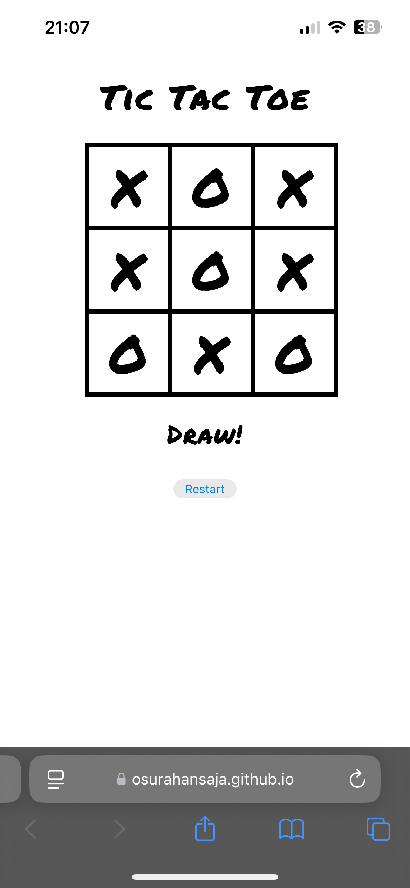

<h1 align="center" style="font-family: 'Orbitron', sans-serif;">Origin Esports CRM</h1>

  This is a simple Tic Tac Toe game built using basic HTML, CSS, and JavaScript. The project serves as a learning exercise to understand the core logic and structure behind creating an interactive web-based game. It features:

- A responsive 3x3 game grid.
- Interactive player turns (X and O).
- Winning logic with a message displayed for the winner.
- A "Restart" button to reset the game.

  This project was done to refresh memory of and to try out basic concepts of DOM manipulation, event handling, and game state management in JavaScript.

---

## Screenshot

